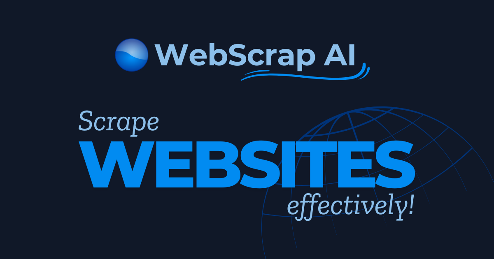
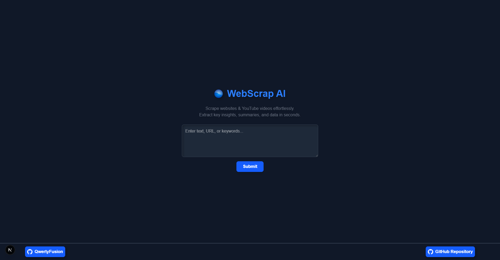
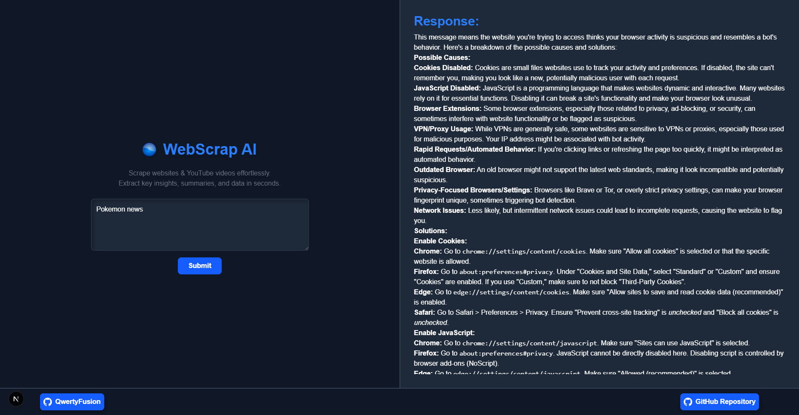

# 🌐 WebScrap AI



<p align="center"><strong>Scrape websites & YouTube videos effortlessly. Extract key insights, summaries, and data in seconds.</strong></p>

A powerful AI-driven web scraping and summarization tool that extracts content from websites, YouTube videos, and search results. It processes the extracted data using Google's Gemini Flash 2.0 for intelligent summarization. Built with Flask, Next.js, Tailwind CSS, and TypeScript for a seamless user experience. 🚀

---

## 🚀 Features

- 🌐 Scrape websites, YouTube transcripts, or perform keyword searches.
- 🤖 Uses **Gemini Flash 2.0** API for intelligent text processing.
- 🔎 DuckDuckGo-powered web search for relevant content.
- 🖥️ **Flask** backend with a **Next.js** frontend.
- 🎨 Styled using **Tailwind CSS**.

---

## 🖼️ Preview
 


---

## 🛠️ Get Started

### 1️⃣ Clone the Repository
```sh
cd web-scrapper-python
```

### 2️⃣ Backend Setup (Flask)

#### Navigate to Backend Folder
```sh
cd backend
```

#### Create and Activate Virtual Environment (venv)
```sh
python -m venv venv  # Create virtual environment
source venv/bin/activate  # MacOS/Linux
venv\Scripts\activate  # Windows
```

#### Install Dependencies
```sh
pip install -r requirements.txt
```

### 3️⃣ Frontend Setup (Next.js)

#### Navigate to Frontend Folder
```sh
cd frontend
```

#### Install Dependencies
```sh
npm install
```

### 4️⃣ Environment Variables

#### Create `.env` inside `backend/` for Flask Backend:
```env
GEMINI_API_KEY=your-gemini-api-key
```

#### Create `.env.local` inside `frontend/` for Next.js:
```env
NEXT_PUBLIC_BACKEND_URL=http://127.0.0.1:5000  # Change if backend runs on a different URL
```

### 5️⃣ Run the Project

#### Start the Flask Backend from `backend/` directory
```sh
python app.py  # Ensure the virtual environment is activated
```

#### Start the Next.js Frontend from `frontend/` directory
```sh
npm run dev  # Runs the frontend on localhost:3000
```

Now, open your browser and go to **http://localhost:3000** to start using WebScrap AI! 🚀

---

## 🛠 Tools Used  

<ol>
  <li>Visual Studio Code</li>
  <li>Next.js</li>
  <li>TypeScript</li>
  <li>Tailwind CSS</li>
  <li>Flask</li>
  <li>BeautifulSoup (Web Scraping)</li>
  <li>DuckDuckGo Search API</li>
  <li>YouTube Transcript API</li>
  <li>Gemini API (AI Processing)</li>
  <li>Git & GitHub (Version Control)</li>
</ol>

---

## 🔗 Link to Tools  

<p align="left">
<a href="https://code.visualstudio.com" target="_blank" rel="noreferrer">
  
</a>&emsp;
<a href="https://nextjs.org/" target="_blank" rel="noreferrer">
  
</a>&emsp;
<a href="https://www.typescriptlang.org/" target="_blank" rel="noreferrer">
  
</a>&emsp;
<a href="https://tailwindcss.com/" target="_blank" rel="noreferrer">
  
</a>&emsp;
<a href="https://flask.palletsprojects.com/" target="_blank" rel="noreferrer">
  
</a>&emsp;
<a href="https://www.crummy.com/software/BeautifulSoup/" target="_blank" rel="noreferrer">
  
</a>&emsp;
<a href="https://duckduckgo.com/" target="_blank" rel="noreferrer">
  
</a>&emsp;
<a href="https://developers.google.com/youtube/v3/docs/captions" target="_blank" rel="noreferrer">
  
</a>&emsp;
<a href="https://ai.google.dev/" target="_blank" rel="noreferrer">
  
</a>&emsp;
<a href="https://git-scm.com/" target="_blank" rel="noreferrer">
  
</a>&emsp;
<a href="https://github.com/" target="_blank" rel="noreferrer">
  
</a>
</p>

---

## 👨‍💻 Developer  

<ul>
  <li><a href="https://github.com/QwertyFusion">[@QwertyFusion]</a></li>
</ul>
